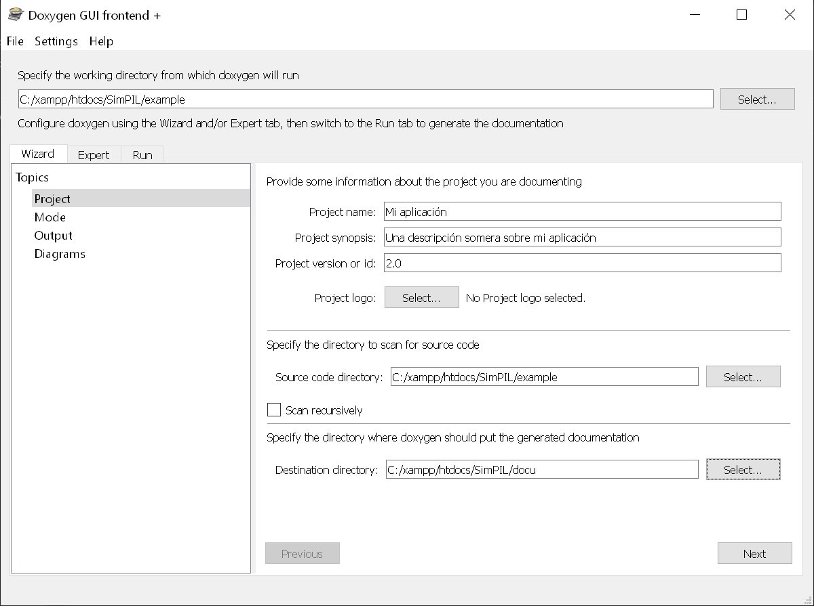

# Documentar Apps
## ¿Por qué documentar una aplicación?
### Por los usuarios
Tan importante es el desarrollo mismo de una aplicación como que su documentación esté plenamente actualizada y sea usable.
Cualquier cambio en el funcionamiento de una aplicación es importante que esté reflejado en su documentación.
### Por los desarrolladores
El mantenimiento evolutivo y correctivo de una aplicación puede tornarse algo engorroso y caro cuando un proyecto no está convenientemente documentado. Los programadores que lleguen de nuevas a trabajar en un proyecto deberán tener acceso a conocer todo el código de manera rápida y sencilla, algo que únicamente un buen sistema de documentación permitirá hacerlo.

### Automatización de la documentación
Sin embargo, si el procedimiento de creación de la documentación no está automatizado, su realización puede suponer otro quebradero de cabeza y consumir tiempo. Afortunadamente, existen sistemas que automatizan este prodceso y que actualizarán la documentación ante cualquier cambio o añadido de código.

## Doxygen
Existen varios sistemas para documentar. Nos centraremos en Doxygen por diferentes motivos (siendo el principal el que se trata de una aplicación [Comparativa Doxygen / PHPdocumentator](https://www.saashub.com/compare-doxygen-vs-phpdocumentor-2)) y no un repositorio PHP.

### Doxywizard
Abriendo la aplicación Doxywizard es posible realizar la configuración completa del proyecto que deseamos documentar. Doxygen puede utilizarse con todas sus características usando su CLI por línea de comando. También puede editarse el fichero *Doxyfile* con un editor de texto y cambiar ahí los valores (Es el mismo archivo que se edita con Doxywizard). 

#### Tipos de archivos a incluir en el proyecto
Características como los tipos de archivo han de editarse directamente en el Doxyfile comoquiera que Doxywizard no las contempla. Para ello, basta con buscar *FILE_PATTERNS* e incluir al final el tipo de archivo que se desea incluir.
```
                         *.ice\
                         *.html
```
Con esta acción se incluirá la orden de incluir los archivos html

### Crear proyecto
*abrimos la aplicación Doxywizard*


- El directorio de trabajo (*working directory*) será donde se guarde finalmente el archivo Doxygen con la configuración que estableceremos, por lo que se recommienda que coincida con el directorio con el código fuente (*source code*)
- incluiremos aquí el nombre del proyecto con una breve descripción así como la versión
- también indicaremos el directorio (aparte) donde se guardará (generará) la documentación


- Al clicar en *Mode* definiremos si queremos optimizarlo para un lenguaje en concreto. También definiremos *All Entities* y seleccionamos "Include cross referenced source code in the output.
- 


- Al clicar en *Output* indicaremos el tipo de ficheros que deseamos para nuestra documentación. HTML plano, con navegación, con función para buscar...
- Podremos generar PDF automáticamente seleccionando LaText
- Otros tipos de documentos son posibles. RTF (ideal para generar archivos word), XML y Docbook.


### Run
Una vez tengamos todo el contenido indicado, seleccionamos la pestalla *Run* y generaremos la documentación clicando en el botón "Run".

# Ver Documentación
Ahora, basta con ir al directorio donde se ha generado la documentación para acceder a ella (nótese que las carpetas en 'html' permitirían publicar en una web o intranet la mencionada documentación, algo interesante si deseamos comunicar nuestro proyecto).

## Start documentación
La documentación podrá iniciarse bien accediendo al archivo inicial de la carpeta HTML (index.html), o bien indicando un archivo MD para que se visualice en primer lugar o bien realizando lo siguiente:

### Incluir un archivo cualquiera como comienzo de la documentación
Muy útil para arrancar desde un entorno web la documentación es generar un archivo index.html en la raíz de la misma el cual contenga un redireccionamiento directo al archivo que quieras que se muestre en primer lugar al acceder (sin tener que configurar un MD en el fichero de configuración ni nada por el estilo) para ello, basta con generar este código en el archivo index.html situado en la raíz:
```html
<html>
<head>
    <meta http-equiv="refresh" content="0; url=html/{HTML-file}">
</head>
<body></body>
</html>
```

[Continuar con Tips Docu PHP](TipsDocuPHP.MD)

---
`título:` Documentar Apps \
`autor:` David G. Bonacho &nbsp;&nbsp;  [www.tizedit.com](https://www.tizedit.com)